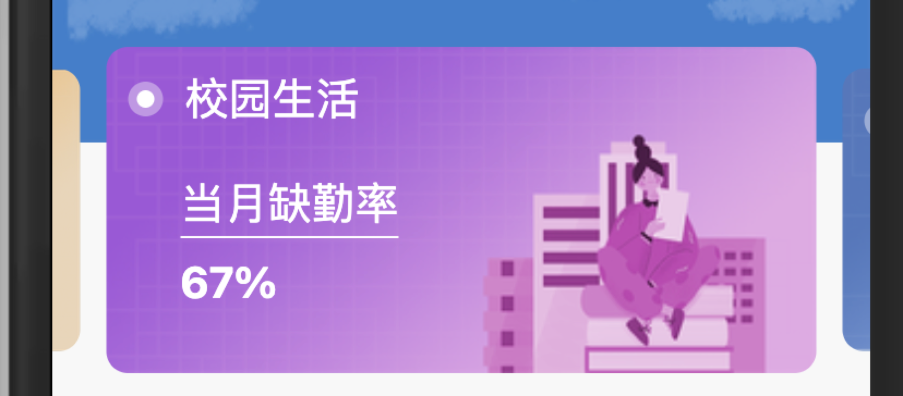
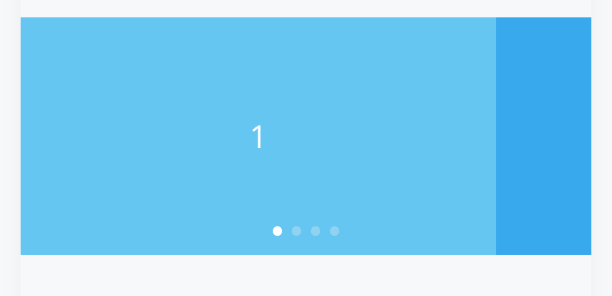
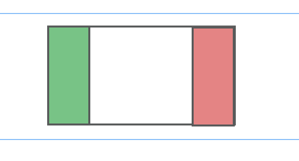

# 基于van-swipe 进行的定制开发

> 没改改其实现逻辑，只是对页面样式进行个性化

## swiper 的实现逻辑

> **说白了就是左右移动或者上下移动，利用translateX 或者translateY，固定显示区域，整个内容左右或上下移动。添加一些动画效果即可实现。**
> **原理简单为什么不自己开发。主要原因在于进场动画，滑动效果动画，以及滑动边界判断等需要处理。能处理好这些。自己开发也是一个不错的选择。**


## 如何实现 swiper 左中右 三块布局

### 效果图


离得最近的是van-swipe的固定宽度这个模版


我们只要想办法实现如下效果




## 实现步骤逻辑

1. 构建van-swipe，设置swiper-item宽度（设置宽度值应小于页面宽度）

2. 滑动后使其移动的距离小于设置宽度 公式： 移动距离 = - ( item宽度 -（屏幕宽度 - item宽度）/ 2) 

3. 当item是显示第一个时，将最后一个item移到第一个前面，当item是显示最后一个时，将第一个item移到最后。

### 主要代码块

##### 设置滑动后处理样式
```vue

     // 设置样式
    setSwiperStyle(index) {
      this.$nextTick(() => {
        const countItem = document.getElementsByClassName('user-card-waring')
        const swiperItem = document.getElementsByClassName('van-swipe-item')
        // 修改 选中样式
        for (let i = 0; i < countItem.length; i++) {
          countItem[i].classList.remove('current')
          if (index == i) {
            countItem[i].classList.add('current')
          }
        }
        // 当前是第一个元素时
        // 需将最后一个item元素前移
        // 移除原有第一个元素的的style样式
        if (index == 0) {
          swiperItem[0].style.removeProperty('transform')
          swiperItem[swiperItem.length - 1].style.transform = `translateX(${-swiperItem.length * this.width}px)`
        } else if (index == swiperItem.length - 1) {
          // 是最后一个元素时
          // 需将第一个元素item 后移
          // 移除原有的最后一个元素的style样式
          swiperItem[swiperItem.length - 1].style.removeProperty('transform')
          swiperItem[0].style.transform = `translateX(${swiperItem.length * this.width}px)`
        } else {
          // 不是第一个和最后一个元素时
          // 需将第一个和最后一个元素item 归位
          // 移除样式即可
          swiperItem[0].style.removeProperty('transform')
          swiperItem[swiperItem.length - 1].style.removeProperty('transform')
        }
        // 父组件移动距离
        const dom = document.getElementsByClassName('van-swipe__track')
        dom[0].style.transform = `translateX(${index * -this.width + this.space / 2}px)`
      })
    }
```

##### 自定义监听touch事件
##### 用来处理覆盖van-swiper的样式
```vue
    addEventListener() {
      // 监听 touchend 事件 用于处理滑块样式
      const span = document.getElementsByClassName('van-swipe__track')
      span[0].addEventListener('touchend', () => {
        this.setSwiperStyle(this.selectIndex)
      })
    },

```

##### 监听移动事件
```vue 

   onChange(index) {
      const countItem = document.getElementsByClassName('user-card-waring')
      // 判断移动方向
      // 主要目的是为加载对应卡片内容提供一个进场动画
      let moveDirection = 'right'
      if (this.selectIndex > index) {
        moveDirection = 'left'
      }
      // 当前选择的是最后一个item 并且上一次item是第一个。则依然是向左移动
      if (countItem.length - 1 == index && this.selectIndex == 0) {
        moveDirection = 'left'
      }
      // 当前是第一个item，并且上一次是最后一个item,则移动方向是向右移动
      if (index == 0 && this.selectIndex == countItem.length - 1) {
        moveDirection = 'right'
      }
      this.setSwiperStyle(index)
      this.selectIndex = index
      this.$emit('onChange', { index: index, moveDirection })
    },

```
