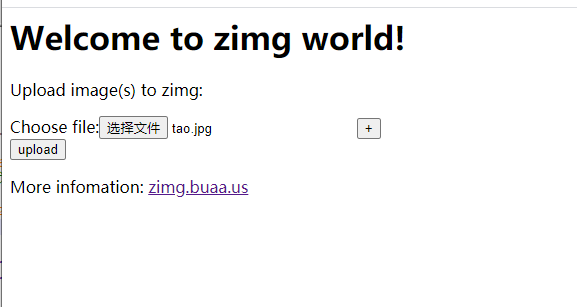

## zimg是图像存储和处理服务器。你可以使用URL参数从zimg获取压缩和缩放的图像。

[官网地址：](http://zimg.buaa.us)
## 安装

### 安装依赖

``` shell

  sudo yum install openssl-devel cmake libevent-devel libjpeg-devel giflib-devel 
  libpng-devel libwebp-devel ImageMagick-devel libmemcached-develel ImageMagick-devel libmemcached-devel

```

### 也可以通过源代码构建依赖关系

#### 1. openssl 安装

``` shell

  wget http://www.openssl.org/source/openssl-1.0.1i.tar.gz
  tar zxvf openssl-1.0.1i.tar.gz
  cd openssl-1.0.1i
  ./config shared --prefix=/usr/local --openssldir=/usr/ssl
  make && make install 

```

#### 2. cmake 安装

``` shell

  wget http://www.cmake.org/files/v3.0/cmake-3.0.1.tar.gz
  tar xzvf cmake-3.0.1.tar.gz 
  cd cmake-3.0.1
  ./bootstrap --prefix=/usr/local 
  make && make install 

```


#### 3. libevent 安装

``` shell

  wget http://cloud.github.com/downloads/libevent/libevent/libevent-2.0.21-stable.tar.gz
  tar zxvf libevent-2.0.21-stable.tar.gz
  cd libevent-2.0.21-stable
  ./configure --prefix=/usr/local 
  make && make install 

```

#### 4. libjpeg-turbo

``` shell

  wget https://downloads.sourceforge.net/project/libjpeg-turbo/1.3.1/libjpeg-turbo-1.3.1.tar.gz
  tar zxvf libjpeg-turbo-1.3.1.tar.gz
  cd libjpeg-turbo-1.3.1
  ./configure --prefix=/usr/local --with-jpeg8
  make && make install

```

##### 4.1 要构建libjpeg-turbo，必须先安装nasm。

  ``` shell

    wget https://www.nasm.us/pub/nasm/releasebuilds/2.14rc16/nasm-2.14rc16.tar.gz
    tar zxvf nasm-2.10.07.tar.gz
    cd nasm-2.10.07
    ./configure
    make
    sudo make install

  ```


#### 5. 构建zimg本身

``` shell

  git clone https://github.com/buaazp/zimg -b master --depth=1
  cd zimg   
  make

```

> 安装过程可能会失败，我在安装的时候就有一个 libjpeg-turbo 安装失败。

#### 6. 运行zimg

``` shell

  cd bin  
  ./zimg conf/zimg.lua

```


> 需要调整配置，可以修改zimg.lua的文件，里面有详细的注释。

#### 运行成功页面

